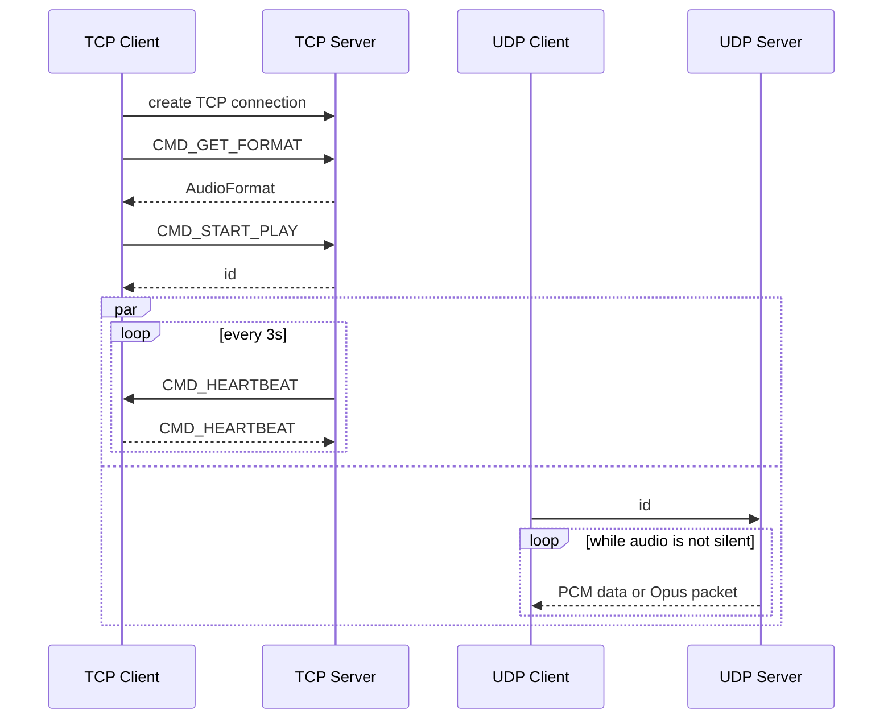

## Compression

`AudioFormat.compression` (field 4) tells the client how to read the UDP payloads. Servers that predate it never set the field, so it reads as `COMPRESSION_NONE`.

| Value | UDP datagram payload |
| --- | --- |
| `COMPRESSION_NONE` | Raw PCM described by `encoding`, split on sample boundaries. |
| `COMPRESSION_OPUS` | Exactly one Opus packet carrying 20 ms of audio. |

With Opus the client decodes to 16-bit PCM, so the format reports `ENCODING_PCM_16BIT`, and `channels` and `sample_rate` describe the decoded stream. Opus streams are always 48 kHz (Android's Opus decoder always outputs 48 kHz), so the server resamples other capture rates (e.g. 44.1 kHz) first. Only mono and stereo are compressed; other layouts fall back to `COMPRESSION_NONE`.

The command line server uses Opus by default; start it with `--compression=none` to send raw PCM. Because the protocol has no capability negotiation, an Opus stream needs a client that understands it.

## Silence

The server may stop sending UDP datagrams while the captured audio is silent (`--silence-timeout`, 2 s by default) and resumes when sound returns. The TCP heartbeat is unaffected. Clients must tolerate gaps in the UDP stream and should not treat them as an error; the Android app pauses its `AudioTrack` during the gap.
