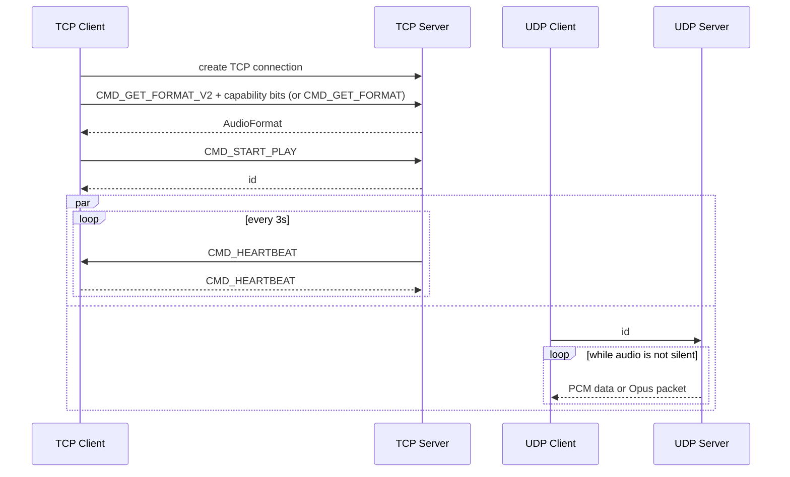

## Byte order

Every multi-byte integer on the wire (command ids, the length prefix before `AudioFormat`, capability bits, the UDP `id` and the Opus sequence number) is little-endian. The server writes them in native order, which is little-endian on every platform it builds for.

## Compression

`AudioFormat.compression` (field 4) tells the client how to read the UDP payloads. Servers that predate it never set the field, so it reads as `COMPRESSION_NONE`.

| Value | UDP datagram payload |
| --- | --- |
| `COMPRESSION_NONE` | Raw PCM described by `encoding`, split on sample boundaries. |
| `COMPRESSION_OPUS` | A 2-byte little-endian sequence number, then exactly one Opus packet carrying 20 ms of audio. |

With Opus the client decodes to 16-bit PCM, so the format reports `ENCODING_PCM_16BIT`, and `channels` and `sample_rate` describe the decoded stream. Opus streams are always 48 kHz (Android's Opus decoder always outputs 48 kHz), so the server resamples other capture rates (e.g. 44.1 kHz) first. Layouts with more than two channels are downmixed to stereo first, and the LFE channel of 5.1 and 7.1 is not mixed in. `opus_pre_skip` (field 5) is the number of 48 kHz samples the decoder discards at stream start.

The sequence number increments by one per packet and wraps at 65536. Clients use it to count lost and late packets and to drop reordered ones; it is not sent with `COMPRESSION_NONE`.

The command line server uses Opus by default; start it with `--compression=none` to send raw PCM.

### Capability negotiation

`CMD_GET_FORMAT_V2` (value 4) is `CMD_GET_FORMAT` followed by a little-endian `uint32` of client capability bits. Bit 0 (`CAP_OPUS`) means the client can decode Opus; a client with no working Opus decoder sends 0. Bits 1 to 31 are unused and should be sent as 0, so a future capability such as FEC or authentication can take a bit instead of needing a new command. The server answers with the same command id, and describes the Opus stream only to clients that set the bit. Everyone else, including clients that still send `CMD_GET_FORMAT`, gets raw PCM, so old and new clients can be connected to the same server. An older server doesn't know `CMD_GET_FORMAT_V2` and may close the connection; a client whose V2 handshake fails can reconnect and use `CMD_GET_FORMAT` instead.

The UDP registration (the client sending its `id`) only counts when it comes from the same IP address as the TCP connection.

## Silence

The server may stop sending UDP datagrams while the captured audio is silent (`--silence-timeout`, 2 s by default) and resumes when sound returns. The TCP heartbeat is unaffected. Clients must tolerate gaps in the UDP stream and should not treat them as an error; the Android app pauses its `AudioTrack` during the gap.
